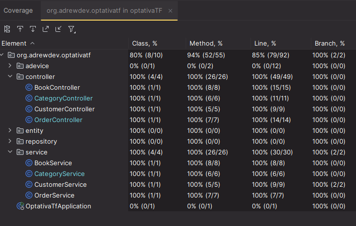

# Book Store Management System

This project is an application for managing a book store. It includes features for handling customers, orders, books, categories, and the relationships between them. It uses Spring Boot with JPA for the backend.

## Technologies

- **Spring Boot**: Framework for backend development.
- **JPA (Java Persistence API)**: Data persistence management with related entities.
- **JUnit 5**: For unit testing each component of the system.
- **Mockito**: For creating unit tests and mocks for dependencies.
- **H2**: In-memory database.
- **Lombok**: To reduce boilerplate code.
- **Maven**: For dependency management and running tests.

## Project Structure

The project is divided into several modules, each with its respective entities, services, controllers, and tests:

- **Entities**: Represent the database tables, such as `CustomerEntity`, `OrderEntity`, `BookEntity`, and `CategoryEntity`.
- **Services**: Contain the business logic to manage the CRUD operations for entities.
- **Controllers**: Expose RESTful APIs to interact with the entities.
- **Tests**: Using JUnit 5 and Mockito to ensure the correct functionality of the entities and services.

### Entities

- **CustomerEntity**: Represents the customers of the store.
- **OrderEntity**: Represents the orders placed by customers.
- **BookEntity**: Represents the books available in the store.
- **CategoryEntity**: Represents the categories to which the books can belong.

### Services

- **CustomerService**: Manages operations related to customers.
- **OrderService**: Manages operations related to orders.
- **BookService**: Manages operations related to books.
- **CategoryService**: Manages operations related to book categories.

### Controllers

- **CustomerController**: REST controller for managing customers.
- **OrderController**: REST controller for managing orders.
- **BookController**: REST controller for managing books.
- **CategoryController**: REST controller for managing categories.

## Getting Started

### Prerequisites

- Java 21 or higher.
- Maven.
- A database (H2 is used).

### Setup

1. **Clone the repository**:

   ```bash
   git clone https://github.com/drewdev02/optativaSpringBootTF.git
   cd optativaSpringBootTF


### Test Coverage


